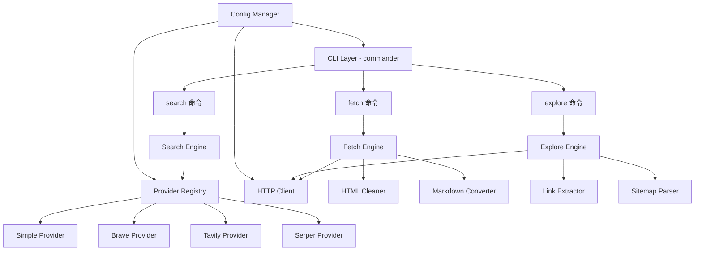

# 设计文档

## 概述

xweb 是一个 TypeScript CLI 工具，遵循与 pai、cmds、xdb 相同的技术栈约定（ESM、commander、tsup、vitest、fast-check）。架构采用分层设计：CLI 层负责命令解析和输出格式化，核心层负责搜索、抓取和发现的业务逻辑，Provider 层负责与外部搜索引擎 API 或网页的交互。

核心设计原则：
- Provider 模式：搜索引擎通过统一接口抽象，支持 API Provider 和 Simple_Provider
- 管道式处理：fetch 命令采用 抓取 → 清洗 → 转换 的管道模式
- 配置驱动：通过 JSON 配置文件管理 API Key 和全局设置

## 架构



## 组件与接口

### CLI 层 (`src/index.ts`)

使用 commander 构建三个子命令：`search`、`fetch`、`explore`。负责参数解析、调用核心引擎、格式化输出。

### Search Engine (`src/search.ts`)

```typescript
interface SearchProvider {
  name: string;
  search(query: string, options: SearchOptions): Promise<SearchResult[]>;
}

interface SearchOptions {
  limit: number;
  deep: boolean;
}

interface SearchResult {
  index: number;
  title: string;
  url: string;
  snippet: string;
}

// 搜索引擎核心逻辑
async function executeSearch(
  query: string,
  options: SearchOptions,
  config: XwebConfig
): Promise<SearchResult[]>;
```

Provider Registry 根据配置选择 Provider：如果指定了 `--provider` 则使用对应 Provider，否则检查配置中的 `default_provider`，如果对应 Provider 有 API Key 则使用，否则回退到 Simple_Provider。

### Simple Provider (`src/providers/simple.ts`)

无需 API Key 的内置搜索 Provider：
1. 构造带随机 User-Agent 的 HTTP 请求
2. 请求 Google 搜索页面
3. 使用正则表达式从 HTML 中提取搜索结果
4. `--deep` 模式下请求多页结果并合并
5. 封装为统一的 `SearchResult[]` 格式

### API Providers (`src/providers/brave.ts`, `tavily.ts`, `serper.ts`)

每个 API Provider 实现 `SearchProvider` 接口：
- 使用配置中的 `api_key` 和 `base_url` 调用对应 API
- 将 API 响应映射为统一的 `SearchResult[]`
- `--deep` 模式调用 Provider 特有的深度搜索参数

### Fetch Engine (`src/fetch.ts`)

```typescript
interface FetchOptions {
  format: 'markdown' | 'text' | 'html' | 'json';
  raw: boolean;
  selector?: string;
}

interface FetchedContent {
  title: string;
  source: string;
  content: string;
  links: Array<{ text: string; url: string }>;
}

async function executeFetch(
  url: string,
  options: FetchOptions,
  config: XwebConfig
): Promise<string>;
```

处理管道：
1. HTTP 请求获取原始 HTML
2. 如果指定 `--selector`，使用 CSS 选择器提取片段
3. 如果非 `--raw` 模式，执行 Readability 启发式清洗（剔除 nav、footer、script、iframe、广告元素）
4. 根据 `--format` 转换为目标格式

### HTML Cleaner (`src/html-cleaner.ts`)

负责 Readability 启发式清洗：
- 移除 `<nav>`, `<footer>`, `<script>`, `<style>`, `<iframe>` 标签
- 移除常见广告相关的 class/id 模式（如 `ad-`, `advertisement`, `sidebar`）
- 保留主要内容区域

### Markdown Converter (`src/markdown-converter.ts`)

负责 HTML 到 Markdown 的转换：
- 使用 turndown 库（或类似轻量级库）进行转换
- 将超链接收集并以引用链接格式置于文档底部
- 保留图片的 alt 描述
- 在文档头部生成 YAML front matter

### Explore Engine (`src/explore.ts`)

```typescript
interface ExploreResult {
  url: string;
  title: string;
}

async function executeExplore(
  url: string,
  options: { json: boolean },
  config: XwebConfig
): Promise<ExploreResult[]>;
```

处理逻辑：
1. 尝试获取 `sitemap.xml`（优先）
2. 如果无 Sitemap，抓取目标页面提取所有内部链接
3. 对链接进行去重和规范化（统一协议、移除锚点、排序）

### Config Manager (`src/config.ts`)

```typescript
interface XwebConfig {
  default_provider: string;
  providers: Record<string, ProviderConfig>;
  fetch_settings: FetchSettings;
}

interface ProviderConfig {
  api_key: string;
  base_url?: string;
}

interface FetchSettings {
  user_agent: string;
  timeout: number;
  max_length: number;
}

function loadConfig(): XwebConfig;
function saveConfig(config: XwebConfig): void;
```

### Output Formatter (`src/formatter.ts`)

负责将内部数据结构格式化为用户可见的输出：
- 搜索结果：编号列表（默认）或 JSON 数组
- Fetch 内容：Markdown（含 front matter）、text、html、json
- Explore 结果：编号列表（默认）或 JSON 数组

## 数据模型

### SearchResult

```typescript
interface SearchResult {
  index: number;    // 结果序号，从 1 开始
  title: string;    // 搜索结果标题
  url: string;      // 搜索结果 URL
  snippet: string;  // 搜索结果摘要
}
```

### FetchedContent

```typescript
interface FetchedContent {
  title: string;                           // 页面标题
  source: string;                          // 原始 URL
  content: string;                         // 转换后的内容
  links: Array<{ text: string; url: string }>; // 提取的链接
}
```

### ExploreResult

```typescript
interface ExploreResult {
  url: string;    // 链接 URL
  title: string;  // 链接标题或文本
}
```

### XwebConfig

```typescript
interface XwebConfig {
  default_provider: string;
  providers: Record<string, {
    api_key: string;
    base_url?: string;
  }>;
  fetch_settings: {
    user_agent: string;
    timeout: number;      // 秒
    max_length: number;   // 最大内容长度（字符数）
  };
}
```

默认配置：

```json
{
  "default_provider": "google",
  "providers": {},
  "fetch_settings": {
    "user_agent": "Mozilla/5.0 (compatible; xweb/1.0)",
    "timeout": 30,
    "max_length": 50000
  }
}
```

## 正确性属性 (Correctness Properties)

*正确性属性是一种在系统所有有效执行中都应成立的特征或行为——本质上是关于系统应该做什么的形式化陈述。属性是人类可读规范与机器可验证正确性保证之间的桥梁。*

### Property 1: SearchResult 序列化往返一致性

*For any* 有效的 SearchResult 对象，将其序列化为 JSON 字符串后再反序列化，应产生与原始对象等价的 SearchResult 对象，且所有字段（index、title、url、snippet）的值保持不变。

**Validates: Requirements 1.7, 5.1, 5.2, 5.3**

### Property 2: Config 序列化往返一致性

*For any* 有效的 XwebConfig 对象，将其序列化为 JSON 后再反序列化，应产生与原始对象等价的配置对象。

**Validates: Requirements 4.5**

### Property 3: Provider 输出格式一致性

*For any* Search_Provider（包括 Simple_Provider 和 API Provider），其返回的每个 SearchResult 对象都应包含 index（正整数）、title（非空字符串）、url（有效 URL 字符串）和 snippet（字符串）四个字段。

**Validates: Requirements 1.1, 1.2, 1.8**

### Property 4: Limit 参数约束结果数量

*For any* 正整数 n 和任意搜索结果集，当指定 `--limit n` 时，返回的搜索结果数组长度应不超过 n。

**Validates: Requirements 1.4**

### Property 5: HTML 清洗与 Raw 模式的对偶性

*For any* 包含 nav、footer、script、iframe 元素的 HTML 文档，非 raw 模式下清洗后的输出不应包含这些元素的内容；而 raw 模式下应保留这些元素的内容。

**Validates: Requirements 2.5, 2.7**

### Property 6: Markdown 转换保留语义内容

*For any* 包含超链接和带 alt 属性图片的 HTML 文档，转换为 Markdown 后：(a) 超链接应以引用链接格式出现在文档底部，(b) 图片的 alt 描述文本应被保留在输出中。

**Validates: Requirements 2.8, 2.9**

### Property 7: CSS 选择器精确提取

*For any* HTML 文档和有效的 CSS 选择器，使用 `--selector` 参数时，输出内容应仅包含匹配该选择器的元素的内容，不包含未匹配元素的内容。

**Validates: Requirements 2.6**

### Property 8: 链接去重与规范化的幂等性

*For any* URL 列表，经过去重和规范化处理后：(a) 结果中不应有重复的 URL，(b) 对结果再次执行去重和规范化应产生相同的结果（幂等性）。

**Validates: Requirements 3.4**

### Property 9: Sitemap XML 解析提取所有 URL

*For any* 有效的 sitemap.xml 内容，解析器应提取出其中所有 `<loc>` 标签内的 URL，且提取的 URL 数量等于 XML 中 `<loc>` 标签的数量。

**Validates: Requirements 3.2**

### Property 10: 内部链接提取完整性

*For any* HTML 文档和基准 URL，链接提取器应找到所有指向同一域名的 `<a>` 标签的 href，且不包含外部域名的链接。

**Validates: Requirements 3.1**

### Property 11: 无效输入产生描述性错误

*For any* 无效的 URL 格式字符串或不存在的 Provider 名称，系统应返回包含错误描述的错误对象，而非抛出未处理的异常。

**Validates: Requirements 6.3, 6.4**

### Property 12: HTTP/API 错误映射为统一格式

*For any* HTTP 错误状态码（4xx、5xx），错误处理器应将其转换为包含状态码和错误描述的统一错误对象。

**Validates: Requirements 6.2, 6.5**

### Property 13: 搜索结果默认格式包含所有字段

*For any* SearchResult 数组，默认格式化输出的字符串应包含每条结果的 title、url 和 snippet。

**Validates: Requirements 8.2**

### Property 14: Explore 结果默认格式包含所有字段

*For any* ExploreResult 数组，默认格式化输出的字符串应包含每条结果的 url 和 title。

**Validates: Requirements 8.3**

### Property 15: Markdown 输出包含 YAML Front Matter

*For any* 具有 title 和 source 的 FetchedContent，Markdown 格式输出应以 `---` 开头的 YAML front matter 开始，且包含 title 和 source 字段。

**Validates: Requirements 8.1**

### Property 16: 无效 JSON 配置回退到默认值

*For any* 非有效 JSON 的字符串作为配置文件内容，Config_Manager 应回退到默认配置，且返回的配置对象与内置默认配置等价。

**Validates: Requirements 4.3**

### Property 17: Text 格式剥离 HTML 标签

*For any* HTML 文档，转换为 text 格式后，输出不应包含任何 HTML 标签（`<...>`），但应保留标签内的文本内容。

**Validates: Requirements 2.2**

### Property 18: JSON 格式输出包含必需字段

*For any* FetchedContent，转换为 JSON 格式后，输出应为包含 title、source、content 三个字段的有效 JSON 对象。

**Validates: Requirements 2.4**

## 错误处理

### 错误类型层次

```typescript
class XwebError extends Error {
  constructor(
    message: string,
    public code: string,
    public statusCode?: number
  ) {
    super(message);
  }
}

class NetworkError extends XwebError {
  constructor(message: string, statusCode?: number) {
    super(message, 'NETWORK_ERROR', statusCode);
  }
}

class TimeoutError extends XwebError {
  constructor(url: string, timeout: number) {
    super(`Request to ${url} timed out after ${timeout}s`, 'TIMEOUT_ERROR');
  }
}

class ValidationError extends XwebError {
  constructor(message: string) {
    super(message, 'VALIDATION_ERROR');
  }
}

class ProviderError extends XwebError {
  constructor(provider: string, message: string) {
    super(`Provider "${provider}": ${message}`, 'PROVIDER_ERROR');
  }
}
```

### 错误处理策略

1. CLI 层捕获所有 XwebError，格式化输出错误信息并以非零退出码退出
2. 网络层将 HTTP 错误状态码映射为 NetworkError
3. 超时通过 AbortController 实现，超时后抛出 TimeoutError
4. URL 验证在命令执行前进行，无效 URL 抛出 ValidationError
5. Provider 不存在或未配置时抛出 ProviderError

## 测试策略

### 测试框架

- 单元测试和属性测试：vitest + fast-check（与 pai、cmds 保持一致）
- 测试目录结构：`vitest/unit/` 和 `vitest/pbt/`

### 属性测试 (Property-Based Testing)

使用 fast-check 库实现属性测试，每个属性测试至少运行 100 次迭代。

每个正确性属性对应一个独立的属性测试文件，标注格式：
```
Feature: xweb-cli, Property N: <property_text>
```

属性测试重点覆盖：
- 序列化往返一致性（SearchResult、Config）
- HTML 清洗的正确性（移除/保留元素）
- Markdown 转换的语义保留
- 链接去重和规范化的幂等性
- 输出格式化的完整性
- 错误处理的统一性

### 单元测试

单元测试覆盖具体示例和边界情况：
- 默认 limit 值为 5
- 配置文件不存在时使用默认配置
- `--version` 和 `--help` 输出
- 特定 Provider 的路由逻辑
- 超时错误处理
- 空 HTML 文档处理

### 测试互补性

- 属性测试：验证跨所有输入的通用属性（如往返一致性、格式完整性）
- 单元测试：验证具体示例、边界情况和错误条件
- 两者互补，共同提供全面的测试覆盖
